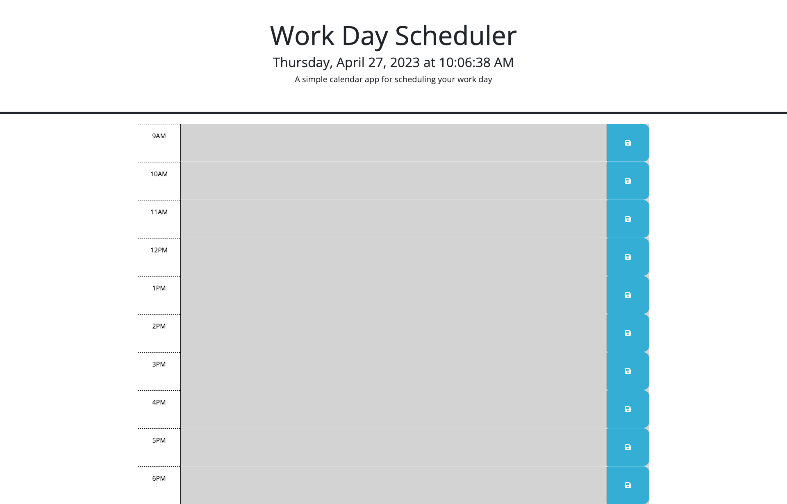

# Dynamic-Daily-Time-Scheduler

## Description

Dynamic Daily Time Scheduler is a simple calendar app that allows a user to keep up with important events in their day. The schedule is divided into time blocks covering standard business hours. Events or tasks are typed into the text field, and are saved in local storage. When the Calendar is opened in the morning, the user can see exactly what they need to accomplish that day, and the hour time blocks help them to manage the time spent on each activity. 

In addition the app opens up with the current date and time at the top of the page, actively updated and powered by Day.js. The hour time blocks are updated by color based on if that hour has passed, is current or is later in the day. As the day progresses, the user can visually see time moving across their day. 

## Features

 - Current date and time visible with a glance
 - tasks or events are saved in local storage allowing the user to plan the next days activities.
 - Color coded time blocks help user stay motivated as they visually track time across their day and over their tasks.

## Tools 

This calendar was dynamically created by modifying provided starter code. It uses HTML, CSS and is powered by jQuery. The time elements use the Day.js library.

## Credits

Stack Overflow
Day.js

## License

Please refer to the LICENSE in the repo.

## Deployed Site:

https://yveivy.github.io/Dynamic-Daily-Time-Scheduler/